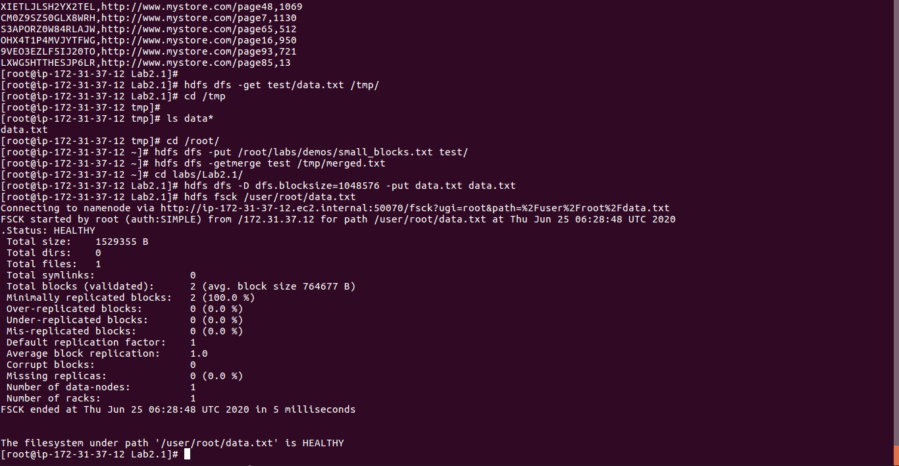

<h2>Objective:   To become familiar with how files are added to and removed from HDFS and how to view files in HDFS. </h2>

<h3> Steps for create, delete folder in hadoop</h3>

<h3> Cat command output in hadoop</h3>

hdfs dfs -cat test/data.txt

<h3> tail command output of file in hadoop</h3>

hdfs dfs -tail test/data.txt

<h3> * Getting a File from HDFS 
     * The  getmerge  Command 
     * Specify the Block Size and Replication Factor </h3>

 a. Put  /root/devph/labs/Lab2.1/data.txt  into  /user/root  in HDFS, giving it a 
blocksize of 1,048,576 bytes.   
 
Hint 
 
The blocksize is defined using the dfs.blocksize property on the command line. 
 
Answer: 
<h4> hdfs dfs -D dfs.blocksize=1048576 -put data.txt data.txt </h4>
b. Run the following  fsck  command on data.txt: 
<h4> hdfs fsck /user/root/data.txt </h4>
c. How many blocks are there for this file? 
 
Answer: The file should be broken down into two blocks. 

# Result 

 You should now be comfortable with executing the various HDFS commands, including creating 
directories, putting files into HDFS, copying files out of HDFS, and deleting files and folders. 
 
