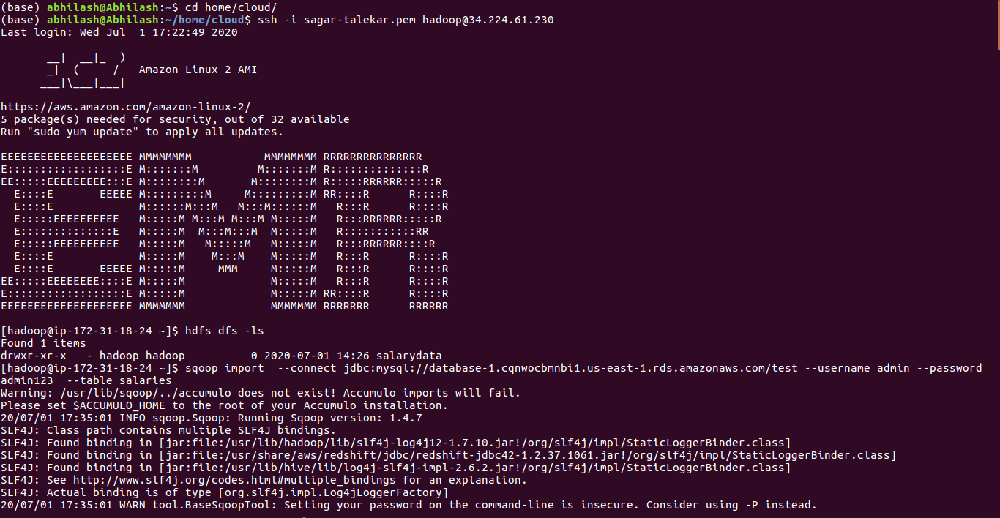

<h1>Lab Day 2 --> Sqoop Implementation</h1>

<h2>Task 1 : Importing RDBMS Data into HDFS</h2>

<h3>Objective : Import data from a database into HDFS using Sqoop.</h3>

<h3>Successful outcome: You will have imported data from MySQL into folders in HDFS.</h3>

<h3>Pre-requisites : </h3>
    
    Your Hadoop cluster on EMR (with Sqoop) should be up and running
    
    For this Lab we are using AWS RDS Service for Our MYSQL RDBMS
    
    We have Imported Data into our RDBMS and this we will use to import into HDFS
    
<h3>Following are the steps to be performed in this lab:-  </h3>
<h3>Step 1 :  </h3>
      
      1. Create an Amazon RDS database. Follow the link to create a new database.
      
      2. Connect this database with MySQL Workbench. Check out this link to connect your RDS database to MySQL Workbench
      
      3. Now create a new salaries table using following sql command
                command 1.
		*create table salaries (
		gender varchar(1),
		age int,
		salary double,
		zipcode int);*

            		command 2.
		alter table salaries add column `id` int(10) unsigned primary KEY AUTO_INCREMENT;
    
 
 

      4. Go to table salaries right click on table schema and select "table data import wizard", Give path of csv file which you stored in your local hartdisk.
         (i.e. --"/home/abhilash/home/Big Data/labs/labs/Lab3.1/salaries.csv") 
	       Note. First you have to convert salaries.txt file into csv file.
	       It gives result 50 records imported.
         

<h3>Step 2 :  </h3>

<h3> now we can import this RDBMS Mysql data into HDFS by using Sqoop.</h3>
	
	1. Now, ssh to your EMR cluster and make sure Sqoop is pre installed in this cluster.

	2. Run sqoop import command to import data from sql database to hdfs
		[hadoop@ip-172-31-18-24 ~]$ sqoop import  --connect jdbc:mysql://database-1.cqnwocbmnbi1.us-east-1.rds.amazonaws.com/test --username admin --password admin123  --table salaries
    It will give result Retrieved 50 records.
    
 

	3. Run command to check whether directory is imported or not 
		hdfs dfs -ls
	
	4. Now check whether salaries directory is created on hdfs with 5 files present as shown below by using command
		hdfs dfs -ls salaries
	   as we can see data is divided into 4 blocks for parallel distribution ecosystem.
	
 
	
	5. To verify whether data is present in these file use cat command for block files
		[hadoop@ip-172-31-18-24 ~]$ hdfs dfs -cat salaries/part-m-00000
		[hadoop@ip-172-31-18-24 ~]$ hdfs dfs -cat salaries/part-m-00001
		[hadoop@ip-172-31-18-24 ~]$ hdfs dfs -cat salaries/part-m-00002
		[hadoop@ip-172-31-18-24 ~]$ hdfs dfs -cat salaries/part-m-00003
		
 

<h3>Step 3 :  </h3>

	1. Now we will import only salary and age data from the database and put it into new directory named salaries2 by using following command
		[hadoop@ip-172-31-18-24 ~]$ sqoop import --connect jdbc:mysql://database-1.cqnwocbmnbi1.us-east-1.rds.amazonaws.com/test --username admin --password admin123  --table salaries --columns salary,age -m 1 --target-dir salaries2
    It will give result Retrieved 50 records.
    

 
	
	2. Run command to check whether directory is imported or not 
		hdfs dfs -ls

	3. Now check whether salaries2 directory is created on hdfs with 2 files present as shown below by using command
		hdfs dfs -ls salaries
		

 

	4. To verify whether data is present in these file use cat command for block files
		[hadoop@ip-172-31-18-24 ~]$ hdfs dfs -cat salaries2/part-m-00000
		

 

<h3>Step 4 :  </h3>

  1. Now we will use --split-by command to split our data accoring to a certain column value and put it into new directory named salaries3
		[hadoop@ip-172-31-18-24 ~]$ sqoop import "-Dorg.apache.sqoop.splitter.allow_text_splitter=true" --connect jdbc:mysql://database-1.cqnwocbmnbi1.us-east-1.rds.amazonaws.com/test --username admin --password admin123 --query "select * from salaries where salary>90000.00 AND \$CONDITIONS" --split-by salaries.gender -m 2 --target-dir salaries3
		It will give result Retrieved 5 records.
    
 
	
	2. Run command to check whether directory is imported or not 
		hdfs dfs -ls

	3. Now check whether salaries3 directory is created on hdfs with 3 files present as shown below by using command
		hdfs dfs -ls salaries
		
 

	4. 4. To verify whether data is present in these file use cat command for block files
		[hadoop@ip-172-31-18-24 ~]$ hdfs dfs -cat salaries3/part-m-00000

		[hadoop@ip-172-31-18-24 ~]$ hdfs dfs -cat salaries3/part-m-00001
		
 

<h2>Here We Have Finished our Task 1 of Importing data from MySQL to HDFS using the entire table, specific columns, and also using the result of a query.</h2>
